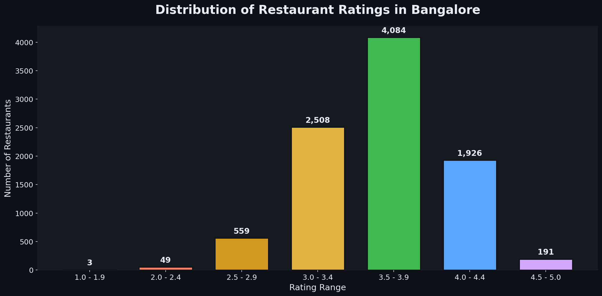
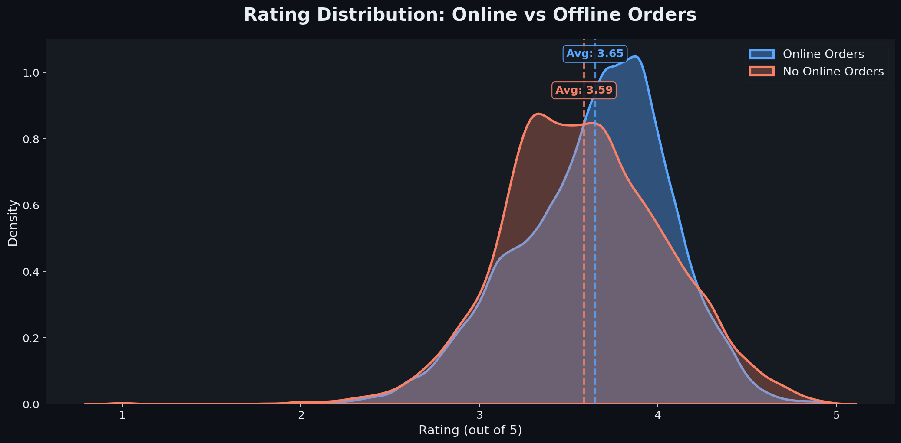
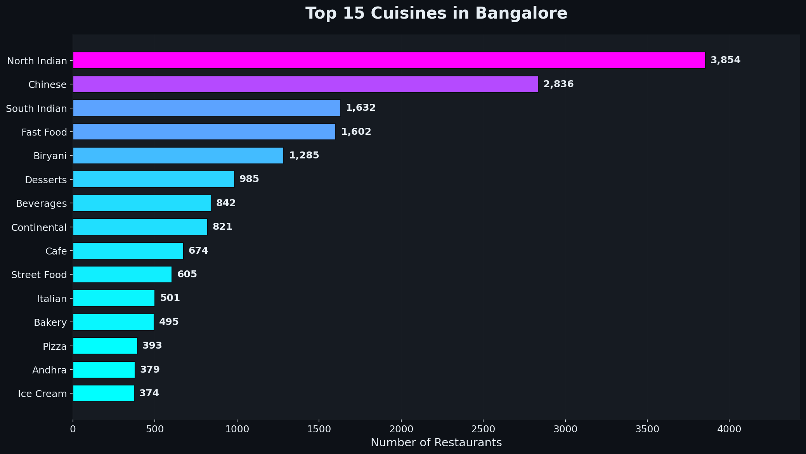
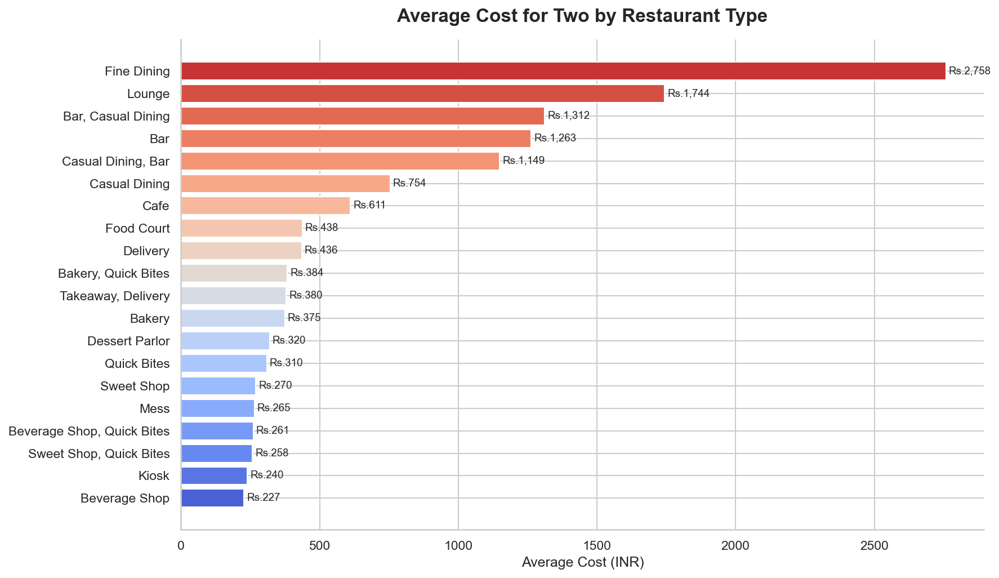
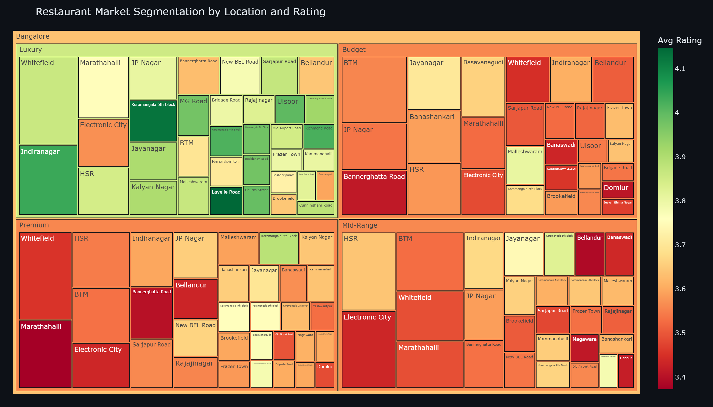
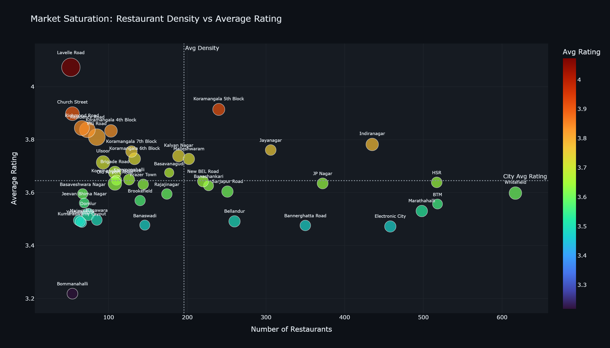
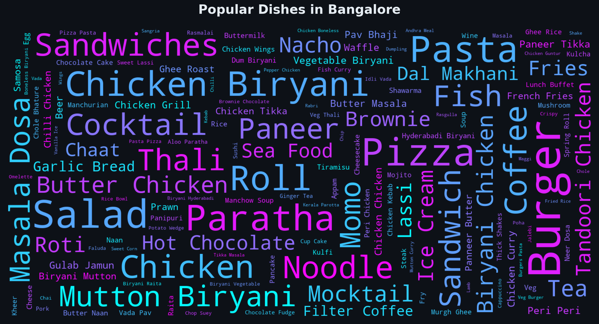

# Zomato Bangalore Restaurant Analytics


> An end-to-end data analysis project that processes 56,000+ Zomato restaurant records from Bangalore to uncover trends, segment markets, and generate actionable insights — all using SQL and Python.

---

## What This Project Does

Bangalore's restaurant scene is massive and fiercely competitive. This project digs into that market by taking a raw Zomato dataset and turning it into something useful: a normalized database, a set of well-structured SQL queries, and a collection of visualizations that actually tell a story.

The goal was to go beyond surface-level analysis. I wanted to understand things like which neighborhoods are oversaturated, whether online ordering actually impacts ratings, and how the market breaks down by price segment.

**What I focused on:**
- Cleaning and normalizing a ~574MB CSV into a proper relational SQLite database (third normal form).
- Writing 15 SQL queries that range from basic aggregations to window functions like `RANK` and `NTILE`.
- Investigating the real impact of online ordering on restaurant ratings.
- Mapping customer segments (budget to luxury) across different neighborhoods.
- Building visualizations that make the findings easy to understand at a glance.

**Database at a glance:**

| Table | Rows | What it stores |
|---|---|---|
| `restaurants` | 16,411 | Core data — name, location, rating, cost for two |
| `restaurant_cuisines` | 32,876 | Links restaurants to their cuisines (3,029 unique cuisines) |
| `restaurant_dishes` | 27,920 | Links restaurants to their most liked dishes (5,880 unique) |
| `reviews` | 103,196 | Individual reviews with ratings and text |

---

## Tools and Stack

- **Database**: SQLite, managed through Python's `sqlite3` module
- **Data Processing**: `pandas`, `numpy`
- **Visualization**: `matplotlib`, `seaborn`, `plotly`
- **Text Analysis**: `wordcloud`, `ast`

---

## Repository Structure

```text
.
├── notebooks/
│   ├── 01_data_loading_and_cleaning.ipynb   # ETL pipeline — CSV to SQLite
│   ├── 02_sql_analysis.ipynb                # 15 SQL queries
│   └── 03_visualizations_and_insights.ipynb  # Charts, treemaps, and word clouds
├── sql_queries/
│   ├── 01_create_tables.sql                 # Schema definitions (4 tables)
│   ├── 02_data_cleaning.sql                 # SQL-based data validation
│   ├── 03_descriptive_analytics.sql         # Queries 1–5
│   ├── 04_comparative_analytics.sql         # Queries 6–10
│   └── 05_advanced_queries.sql              # Queries 11–15 (window functions)
├── images/                                  # Exported charts (PNG and HTML)
├── requirements.txt
└── README.md
```

*The raw `zomato.csv` dataset and `.db` files aren't included in this repo because of their size. You'll need to download the dataset separately (instructions below).*

---

## Key Findings

### 1. Rating Distribution
Most restaurants in Bangalore fall in the 3.5 to 4.4 rating range, forming a rough bell curve. Very few dip below 2.0 or hit a perfect 5.0 — the market clusters tightly in the middle.



---

### 2. Online Ordering Makes a Real Difference
Restaurants that accept online orders consistently rate higher, with most landing in the 3.8–4.0 range. The distribution is also tighter compared to offline-only restaurants. If you're running a restaurant in Bangalore, enabling online delivery isn't optional anymore — it's table stakes.



---

### 3. What Cuisines Dominate
North Indian and Chinese food lead by a wide margin, but South Indian cuisine holds its own — which makes sense given Bangalore's demographics. The diversity of cuisines is one of the things that makes this dataset interesting.



---

### 4. Cost Varies Significantly by Restaurant Type
Fine dining and pubs/bars sit at the top of the cost spectrum, while quick bites and delivery-focused places are the most affordable. Not surprising, but the gap is wider than you might expect.



---

### 5. Market Segmentation by Price
I used `NTILE(4)` in SQL to split restaurants into four price segments: budget, economy, premium, and luxury. The premium and luxury segments tend to have higher ratings, but the budget segment dominates in sheer volume — especially in neighborhoods like BTM and HSR Layout.



---

### 6. Where the Market Is (and Isn't) Saturated
By plotting restaurant density against average ratings, I could identify two types of neighborhoods: "sweet spots" (low density, high ratings — good places to open a restaurant) and "red oceans" (crowded markets where ratings tend to suffer).



---

### 7. Most Loved Dishes
A word cloud of the most frequently liked dishes shows what Bangalore really craves.



---

## SQL Techniques Used

Here's a quick overview of the SQL patterns I applied across the 15 queries:

| Technique | Where it's used |
|---|---|
| `CASE WHEN` + `GROUP BY` | Rating distribution buckets |
| `JOIN` + `AVG` + `LIMIT` | Top cuisines by count |
| `HAVING` + aggregate filters | Restaurant types with 50+ entries |
| Subquery percentage | Online order availability percentage |
| `NULLIF` + ratio calculation | Cost-per-rating (finding overpriced cuisines) |
| `RANK() OVER (PARTITION BY)` | Top 3 restaurants per location |
| `AVG() OVER (ROWS BETWEEN)` | Running average of cost |
| Self-join with inequality | Cuisine co-occurrence pairs |
| `NTILE(4)` + CTE | Price segmentation into quartiles |

---

## Running This Locally

1. **Clone the repo:**
   ```bash
   git clone https://github.com/himanshu-0033/Zomato_Data_analysis.git
   cd Zomato_Data_analysis
   ```

2. **Install dependencies:**
   ```bash
   pip install -r requirements.txt
   ```

3. **Get the data:**
   Download the [Zomato Bangalore dataset from Kaggle](https://www.kaggle.com/datasets/himanshupoddar/zomato-bangalore-restaurants) and place `zomato.csv` in the project root.

4. **Run the notebooks in order:**
   - `01_data_loading_and_cleaning.ipynb` — builds the SQLite database from the CSV
   - `02_sql_analysis.ipynb` — runs all 15 SQL queries
   - `03_visualizations_and_insights.ipynb` — generates the charts and visualizations

---

## Author

**Himanshu**

[](https://www.linkedin.com/in/himanshu-malik-a3aa0331a/)
[](https://github.com/himanshu-0033)
